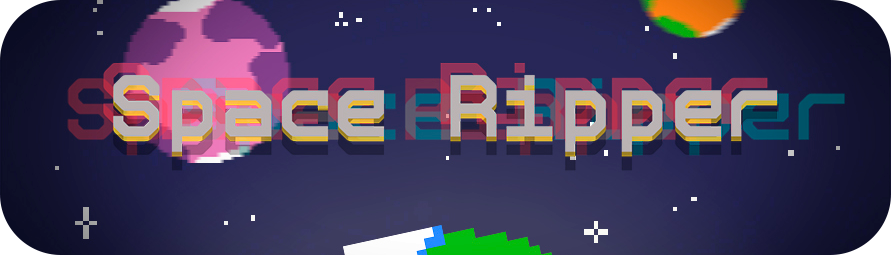
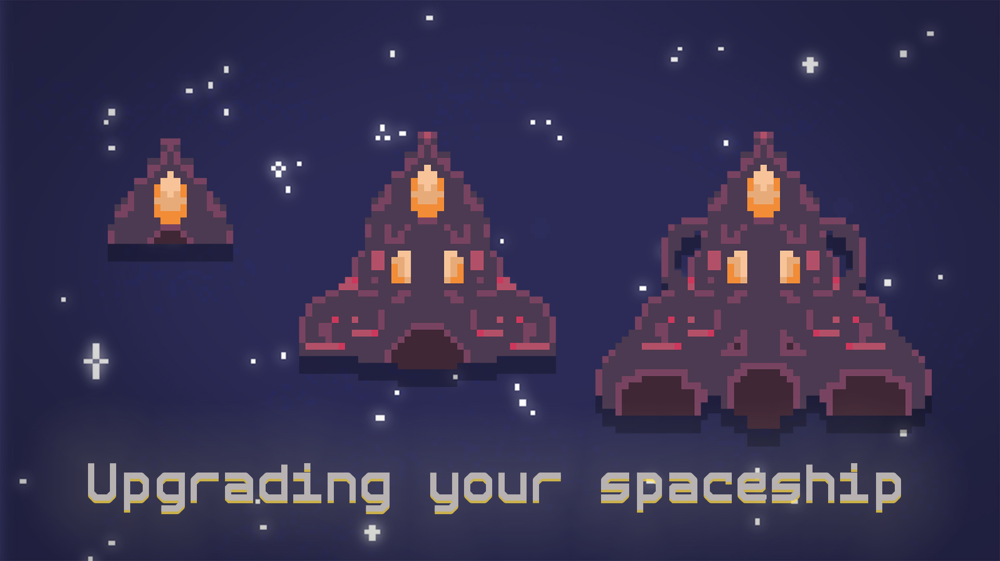
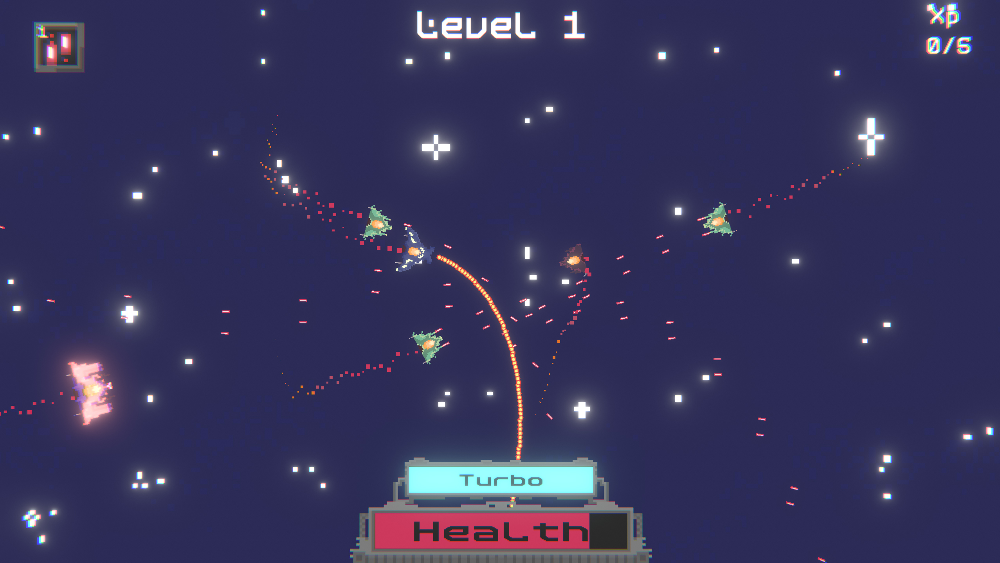

    

### **About game**
**Space Ripper** is a top-down shooter developed during a **48-hour** game jam with the theme `"Space Game"`. This was my first participation in a game jam, and it took place in **2022**.

**Become the most wanted outlaw in the galaxy!**  
Survive, upgrade, and dominate in this adrenaline-packed space adventure!

---

## 🌌 Lore

You are **The Ripper** — a legendary space bandit hunted across the galaxy! In a universe where technology thrives on **energy crystals**, your mission is to outsmart your pursuers, harness the power of crystals, and turn even the weakest ship into an unstoppable force. Upgrade, adapt, and leave destruction in your wake!

---

    
    
    

## 🎮 Game Description

**Space Ripper** is a fast-paced space shooter where you:  
✔ **Travel** through treacherous star systems.  
✔ **Blow up planets** to loot energy crystals.  
✔ **Battle** relentless enemies — from bounty hunters to galactic drones.  
✔ **Upgrade** your ship with powerful weapons, shields, and engines.  
✔ **Rise** to the top of the galactic most-wanted list!

---

## 🕹 Controls

| **Action**               | **Key**           |
|--------------------------|-------------------|
| Move                     | `W`, `A`, `S`, `D`|
| Rotate Spaceship         | Drag `Mouse`      |
| Switch Weapon            | `1`, `2`, `3`     |

---

## 💥 Features

 **Dynamic Ship Customization**: Use energy crystals to upgrade weapons, shields, and engines.  
 **Epic Space Battles**: Fight swarms of enemies with 3 unique weapon types.  
 **Destructible Planets**: Destroy planets to collect resources (and watch them explode!).  
 **Progression System**: Unlock new abilities and climb the leaderboards.  

---

## 🛠 Installation

### First way
Download the game from [itch.io](https://vdizv.itch.io/space-ripper).

### Second way
Get the latest version from [Releases](https://github.com/vZidv/SpaceGame/releases).
Extract the ZIP file.
Launch `Space Ripper.exe`.

---

## 📜 License

This project is licensed under the **MIT License**. See [LICENSE](LICENSE) for details.

---
